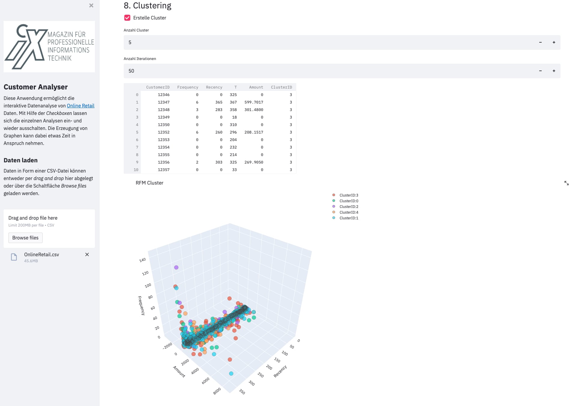
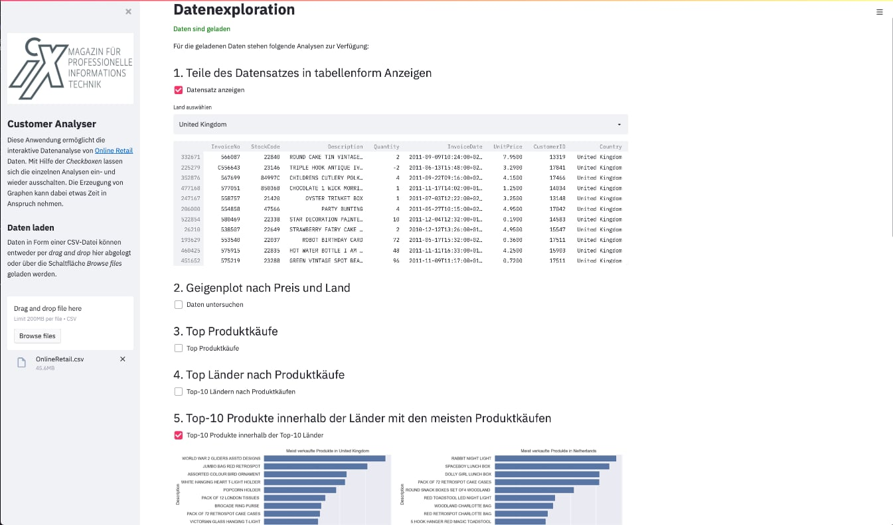

# ix-streamlit

This projects implements a simple Streamlit application for data exploration of online retail data.



##  Setup

1. Clone this repository with
```
$ git clone https://github.com/rawar/ix-streamlit.git
```

1. Upgrade your Python package installer pip
```
$ python3 -m pip install --upgrade pip
```

1. Create a virtual environment
```
$ cd ix-streamlit && python3 -m venv .venv
```

1. Activate your virtual environment
```
$ source .venv/bin/activate
```

1. Install all requirements
```
pip install -r requirements.txt
```

## How to run

To start the Streamlit app, run the Python app from the command line through the Streamlit CLI.  
```
.venv/bin/python -m streamlit.cli run app/app.py
```

###  How to use

The app contains 9 different analysis aground online retail analysis. Each analysis can run with a click to the 
checkboxes, after you load the data before. Some analysis has some input fields to influencing the output. 



Some analysis generates a lot of plots. With a special thanks to [stqdm](https://pypi.org/project/stqdm/)  
a progressbar should shorten the time until the plot display. 